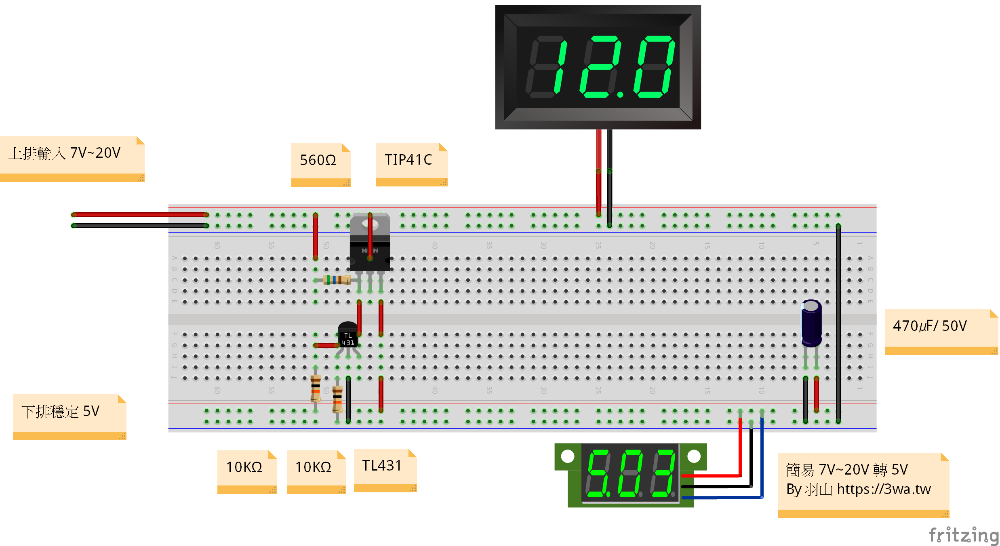
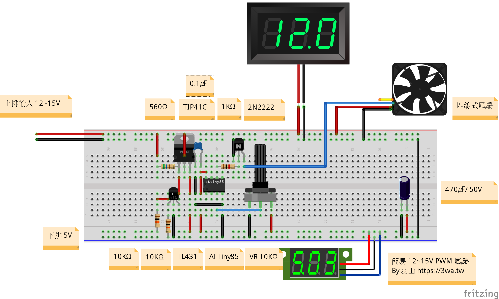

# 115ATTiny85FanPWM

使用 `ATTiny85` 產生約 `25kHz` PWM 訊號，控制 4 線式 12V 風扇的轉速。  
本專案透過 `PB4` 讀取 `10K VR` 可變電阻的類比值，再由 `PB1 / OC1A` 輸出 PWM，搭配外部電晶體電路驅動風扇的 PWM 腳位。

整個 repo 除了 Arduino 程式，還包含 Fritzing 電路圖、接線示意圖與自訂零件，可作為重做電路與後續修改的基礎。

---

## 功能特色
- 使用 `ATTiny85` 內建 Timer/PWM 輸出約 `25kHz` 控制訊號
- 使用 `10K VR` 旋鈕調整風扇轉速
- `PB4` 讀取 ADC，將 `0~1023` 映射為 `0~10` 共 11 段輸出
- `PB1 / OC1A` 輸出 PWM，適合 4 線式 PWM 風扇控制
- 提供 `7V~20V -> 5V` 穩壓參考電路
- 附 Fritzing 原始檔與自訂零件，可直接修改電路圖

---

## 作者
- 羽山秋人(https://3wa.tw)

---

## 日期
- 2026-04-14

---

## 材料清單
- `ATTiny85`
- `10K VR` 可變電阻
- `2N2222` (EBC)
- `TIP41C` (BCE)
- `TL431`
- `560R` 電阻
- `1K` 電阻
- `10K` 電阻 x2
- `470uF / 50V` 電解電容
- 4 線式 PWM 風扇
- `12V~15V` 風扇電源，或依實際電路使用 `7V~20V` 輸入後轉 `5V`

---

## 檔案說明
- `115ATTiny85FanPWM.ino`
  - 主程式，負責 ADC 讀值、PWM 初始化與輸出占空比控制
- `circuit12to5.png`
  - `7V~20V` 輸入轉穩定 `5V` 的接線示意圖
- `circuit_PWM.png`
  - 完整 PWM 風扇控制接線示意圖
- `fritzing_parts/`
  - 本專案使用到的 Fritzing 自訂零件

---

## 程式與接腳說明
- `ATTiny85 Clock` 設定為 `Internal 16MHz`
- `PB4` 作為 ADC 輸入，接 `10K VR` 可變電阻
- `PB1 / OC1A` 作為 PWM 輸出腳位
- `PWM_TOP = 39`
  - 在目前設定下，PWM 頻率約為 `25kHz`
- 程式流程
  - 先初始化 ADC
  - 再初始化 Timer1 PWM 輸出
  - 持續讀取 `PB4` 的 ADC 值
  - 將 ADC `0~1023` 映射成 `0~10`
  - 再換算成 `OCR1A` 所需的輸出值

程式中 PWM 不是直接把風扇 duty 寫入輸出腳位，而是先算出風扇目標 duty，再因應外部 `2N2222` 反相電路，輸出相反的占空比：

```c
fanDuty = (uint32_t)level * PWM_TOP / 10;
outDuty = PWM_TOP - fanDuty;
OCR1A = outDuty;
```

如果旋鈕方向與你的習慣相反，可在主迴圈中啟用這行反向邏輯：

```c
// level10 = 10 - level10;
```

---

## 接線圖

### 1. 7V~20V 轉穩定 5V
這張圖是獨立的降壓/穩壓參考，用來提供 `ATTiny85` 與控制電路穩定的 `5V` 電源。



重點：
- 上排輸入為 `7V~20V`
- 下排輸出為穩定 `5V`
- 使用 `TL431`、`TIP41C` 與電阻組成簡易穩壓

### 2. PWM 風扇控制電路
這張圖是完整的風扇控制接線，包含 `ATTiny85`、可變電阻、PWM 輸出級與 4 線風扇。



重點：
- `PB4` 接 `10K VR`，用來調整速度
- `PB1` 經 `1K` 電阻送入 `2N2222` (EBC)
- `2N2222` 負責將 PWM 訊號反相後送往風扇 PWM 腳
- 風扇主電源仍由 `12V~15V` 供應，不是由 ATTiny85 直接供電
- `470uF / 50V` 電容用於電源穩定

---

## 燒錄與使用方式
1. 使用 Arduino IDE 或相容工具開啟 `115ATTiny85FanPWM.ino`
2. 確認目標晶片為 `ATTiny85`
3. 確認時脈設定為 `Internal 16MHz`
4. 將程式燒錄進晶片
5. 按照 `circuit_PWM.png` 接好電路
6. 上電後旋轉 `10K VR`，即可改變風扇 PWM 占空比與轉速

---

## 注意事項
- 這個專案控制的是 4 線風扇的 `PWM 控制腳`，不是直接切換風扇主電源
- 不同品牌或型號的 4 線風扇，PWM 相容性可能略有差異，請以實測為準
- 若風扇規格對 PWM 頻率有要求，請先確認是否接受約 `25kHz` 控制訊號
- 外部 `2N2222` 會造成訊號反相，因此程式內有做反向補償
- 若調整旋鈕後速度變化方向與預期相反，可啟用程式中的反向那一行
- 專案中的電路圖可作為實作參考，但實際配線、散熱與供電容量仍需依你的風扇規格調整

---

## 授權
MIT License

